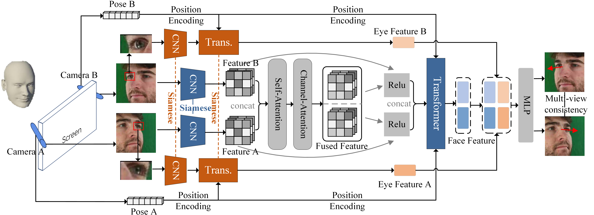

## DVF-Gaze
Leveraging the Far-eye Images for Dual-View Gaze Estimation.

## Description


We propose a novel approach, DVF-Gaze, for dual-view gaze estimation. Different from single-view approaches that tend to utilize all available eye images, we find that leveraging the far-eye image from each view proves su perior to utilizing two eye images in the context of dual-view gaze estimation. This observation seems counter-intuitive since the far-eye often occupies fewer pixels than the close eye.


This code is developed on the repository https://github.com/yihuacheng/DVGaze, which is written by Yihua Cheng and Feng Lu. For more information about the baseline method please see their ICCV 2023 paper 'DVGaze: Dual-View Gaze Estimation'.

## Usage
Please re-write the config file in `config/train/xxx.yaml` and `config/test/xxx.yaml`.

To train a model, Please run the command:
```
python trainer/total.py config/train/xxx.yaml
```

To evaluate a model, please run the command:
```
python tester/total.py config/train/xxx.yaml config/test/xxx.yaml
```

where `config/train/xxx.yaml` indicates the config for training model.


Please download the label file from <a href='https://drive.google.com/drive/folders/16yt3xjkQzR_hA5EMFWQhrL-s2f3A3MKb?usp=sharing'> Google Driver </a>. We are not authorized to distribute image files. 

**All codes are beta version and we will keep updating this repositories.**
